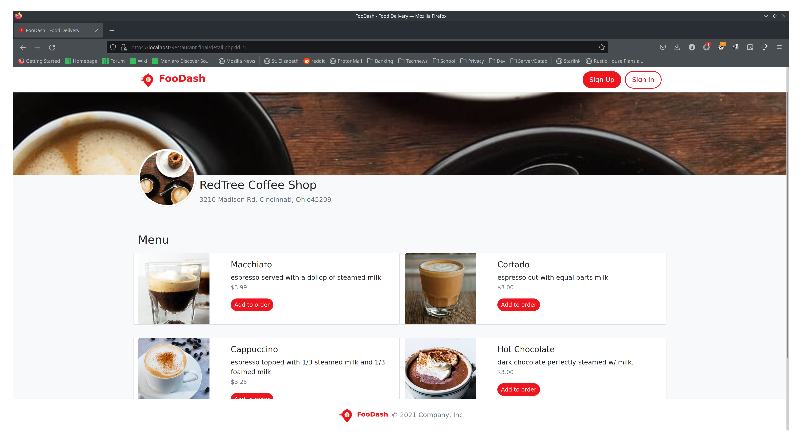

# Restaurant
The restuarant app was created for ASE 230 by Trung Robert and Blake.
It uses PHP and JS to run a site we call FooDash. when the site is first
loaded the user is presented with the ability to see the restaurants and
see what they have to offer but can not order from them. If someone attempts
placing an order before signing in it will redirect them to the sign in page.
 
the URL to reach the test site is: https://foodash-test.herokuapp.com/

After you log in you will be able to add orders to your cart and check out from the cart page.
While signed in you are also able to view your user profile and edit the information of the user.

Another functionality is being able to sign in as an admin. This will allow you to edit the pages
by adding and removing restaurants as well as adding, deleting, and modifying menu items for each
restaurant. As with normal users, the admin is also able to view and edit their profile information.
